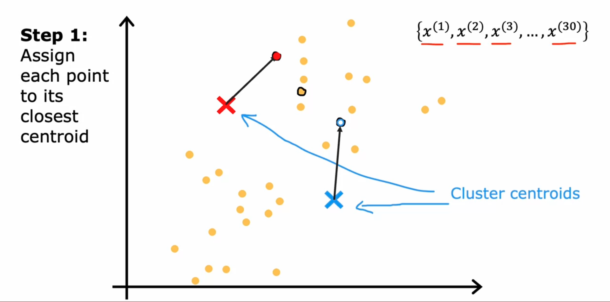
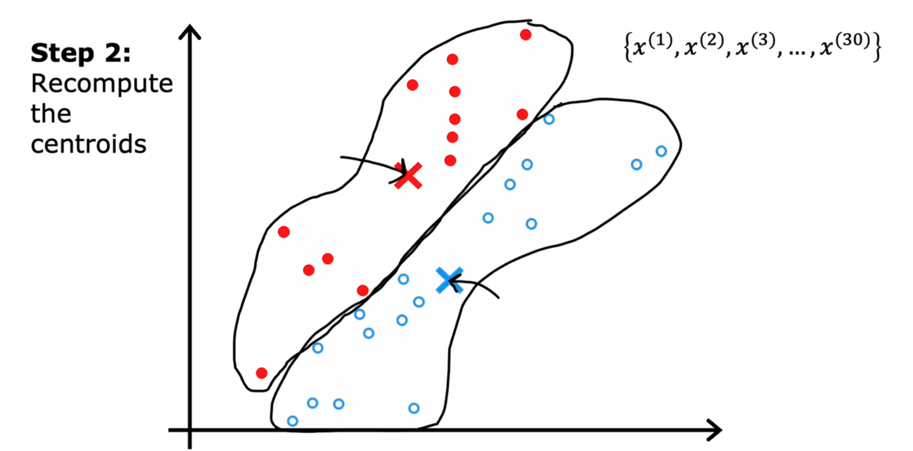
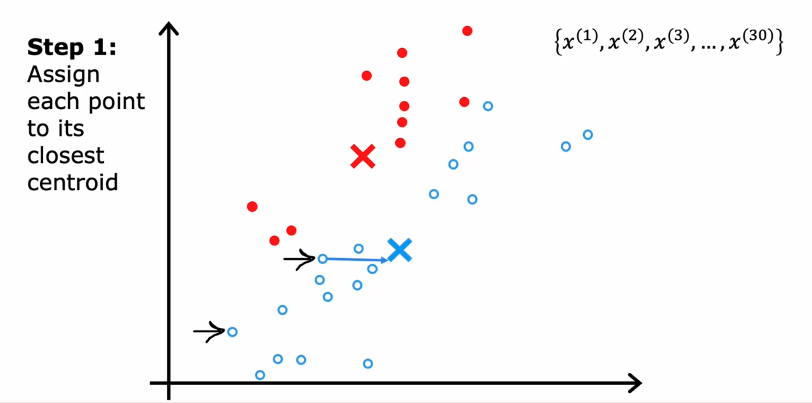
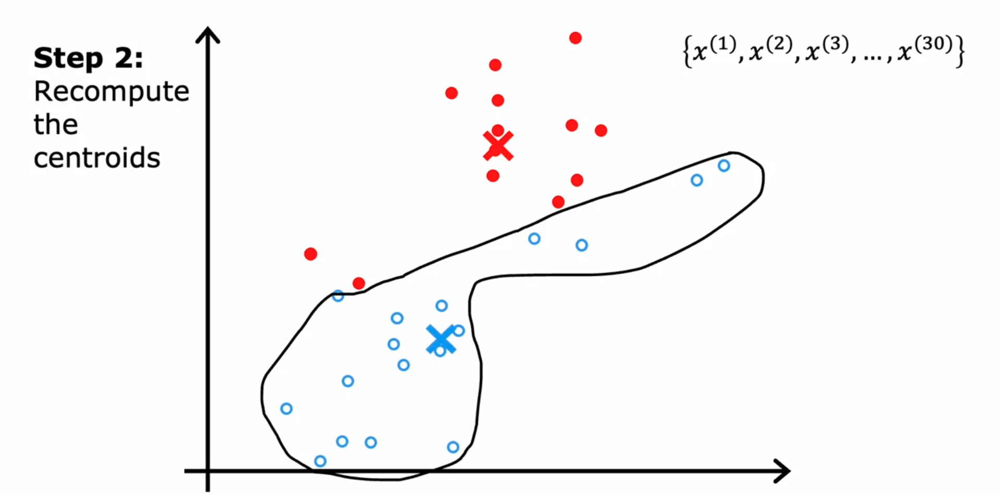
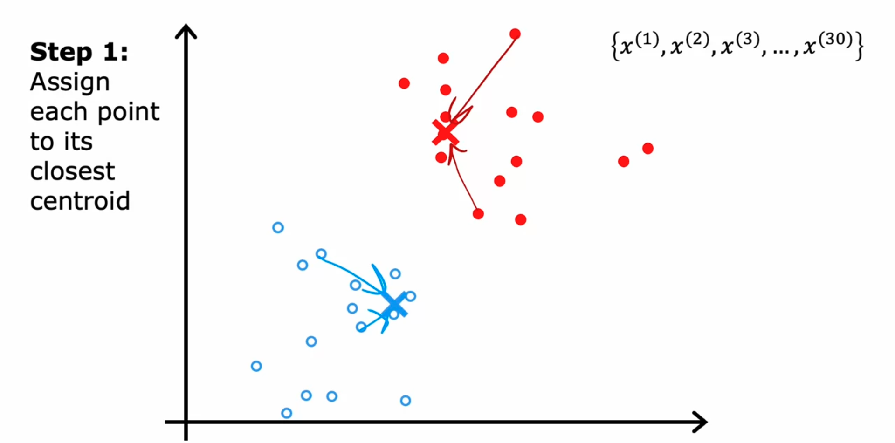
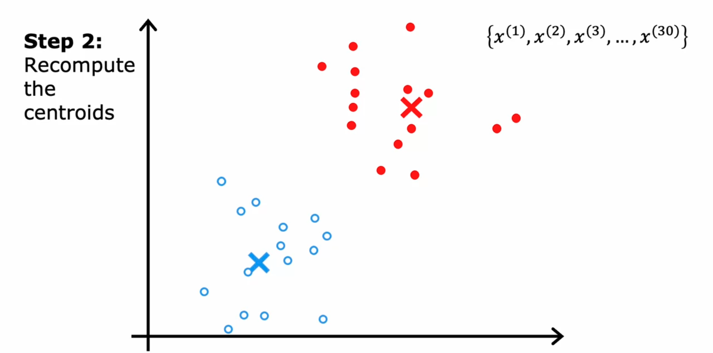
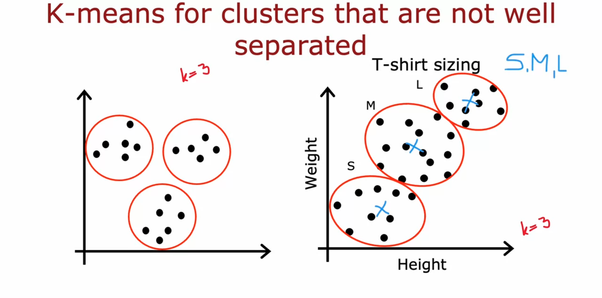
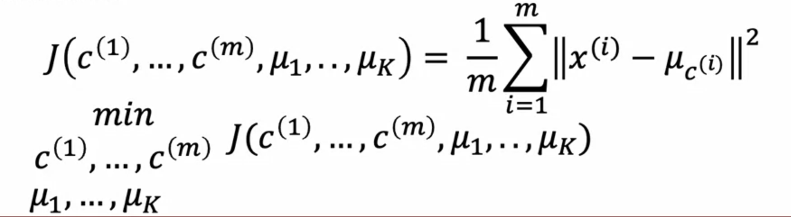

# Clustering

---

## What is clustering?

Clustering is a type of unsupervised learning in machine learning where the goal is to group a set of objects in such a way that objects in the same group (called a cluster) are more similar to each other than to those in other groups. It is used to find structure in unlabeled data by identifying natural groupings or patterns.

### Common clustering algorithms include:
* K-means clustering
* Hierarchical clustering
* DBSCAN (Density-Based Spatial Clustering of Applications with Noise)

### Applications of clustering
* Grouping similar news
* Market segmentation
* DNA analysis
* Astronomical data analysis

Applications of clustering include customer segmentation, image compression, and anomaly detection.

---

## K-means intuition 

K-means clustering is one of the simplest and most popular unsupervised machine learning algorithms. The intuition behind K-means is to partition the data into K distinct clusters based on distance to the centroid of a cluster.

### Steps involved in K-means clustering:
1. **Initialization**: Choose K initial centroids randomly from the dataset.
2. **Assignment**: Assign each data point to the nearest centroid, forming K clusters.
3. **Update**: Calculate the new centroids as the mean of all data points assigned to each cluster.
4. **Repeat**: Repeat the assignment and update steps until the centroids no longer change significantly or a maximum number of iterations is reached.

### Key points:
* The number of clusters, K, must be specified beforehand.
* The algorithm aims to minimize the within-cluster variance (sum of squared distances from each point to its centroid).
* K-means is sensitive to the initial placement of centroids and may converge to a local minimum.

### Example:
Consider a dataset with points in a 2D space. The K-means algorithm will:
1. Randomly initialize K centroids.
2. Assign each point to the nearest centroid.
3. Recalculate the centroids based on the assigned points.
4. Repeat the process until the centroids stabilize.

### Visual Example:

Here are some visual examples of K-means clustering:

 

 

 

K-means is widely used in various applications such as customer segmentation, image compression, and pattern recognition due to its simplicity and efficiency.

---

## K-means algorithm

### Steps

1. Randomly initialize K cluster centroids µ1, µ2, ... ,µk

2. 
Repeat {  
    **Assign points to cluster centroids**  
    for i = 1 to m  
        c(i) := index(from 1 to k) of cluster centroid closest to x(i)  
    **Move cluster centroids**  
    for k = 1 to K  
        µk := average(mean) of points assigned to cluster k  
}  

**Note:** Sometimes a cluster may have zero training examples, in that case, we can remove that cluster. (k = k-1)

### K-means for clusters that are not well seperated

For example, consider a t-shirt manufacturing company that decides to cluster customer sizes into three categories: S, M, and L. They collect data on customers' height and weight, plot it on a 2D graph, and find that the data points are not well separated. However, they can still cluster the data into three groups, as shown in the figure below.

---

## Optimization objective

---

### k-means optimization objective 

c(i) = index of cluster (1,2,...,k) to which example x(i) is currently assigned  
µk = cluster centroid k  
µc = cluster centroid of cluster  to which example x(i) has been assigned  

### Cost function 

